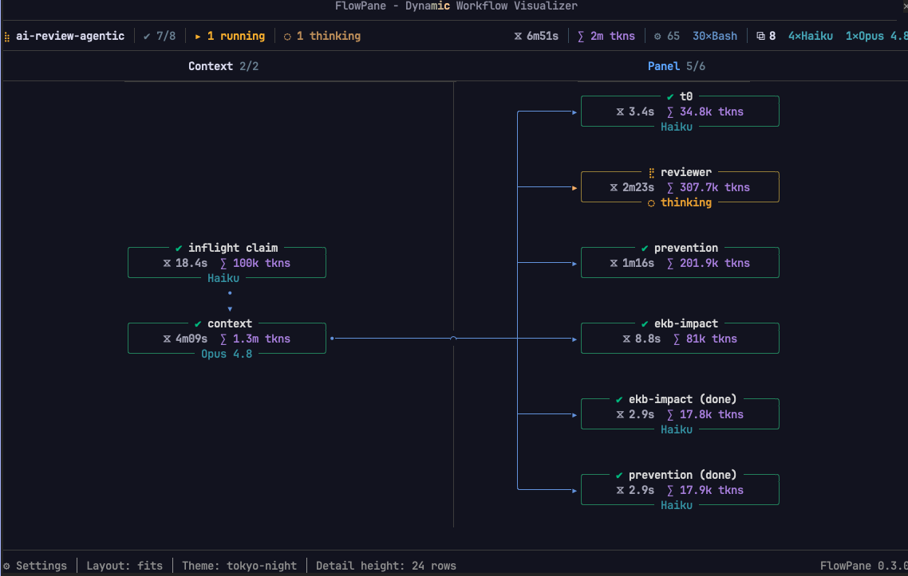
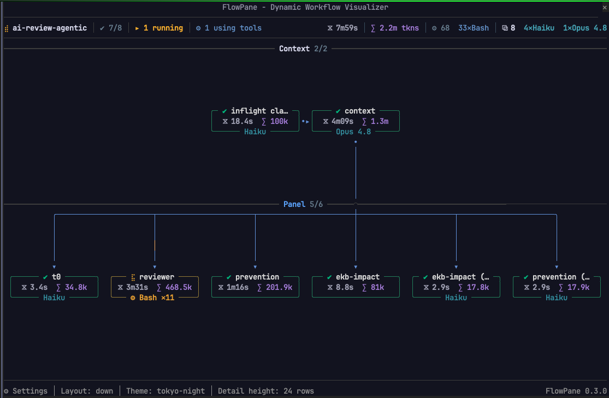
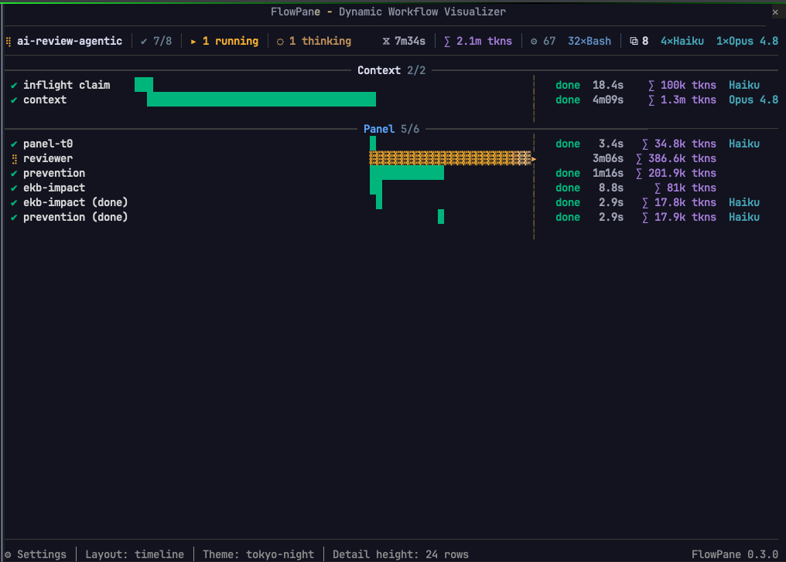
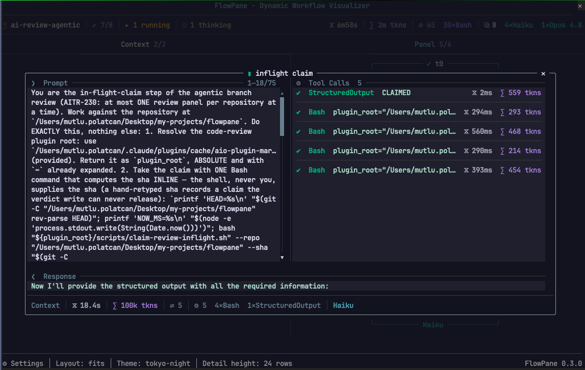

# flowpane — a live graph of a Claude Code workflow run

**Claude Code** runs a workflow as a list of agents ticking over. **flowpane**
draws it instead: one column per phase, an agent as a node, the barriers and
carries between them as edges, repainted about eight times a second while the
run is live.

Built on Claude Code **function hooks** (**Claude Mods**), the early-access
plugin API from [anthropics/claude-code#91870](https://github.com/anthropics/claude-code/issues/91870).

## Screenshots

| Phases across | Phases down |
| --- | --- |
|  |  |

| Timeline | A node's detail |
| --- | --- |
|  |  |

## What it draws

- **Every agent as a node**, framed in its own state — green for done, yellow
  for running, red for failed, grey for one the run cut off — with its name,
  how long it took, what it spent and the model it ran on.
- **The shape of the run**: phases as columns or bands, fan-outs folded to fit,
  loops marked with the number of passes, chains that stopped early left short,
  and a phase the run never entered drawn as skipped rather than as failed.
- **What is happening now**: a travelling light along the live wires, the tool
  an agent is calling written on its card, and a running total of tokens, tool
  calls and models on the run line.
- **What an agent was asked and answered**: press a node for a dialog carrying
  its prompt, every tool call with its input, and its result.
- **The session's other runs**: press the run's name for a menu of them,
  grouped by state; with nothing running the pane lists them in place of the
  graph.
- **A nested workflow as a run of its own**: a phase whose agents belong to a
  workflow this one called is drawn in the dashed register every layout uses for
  work that is not this run's, folded to one node with a mark per trip. Press its
  ▸ and every agent inside stands separately, each with its own detail.
- **Three layouts** — **across**, **down**, or **timeline**: phases laid across
  the pane, stacked down it, or drawn as bars against the clock — and **twelve
  palettes**, nine dark and three light.

## Install

From the marketplace, inside **Claude Code**:

```
/plugin marketplace add mpolatcan/cc-plugins
/plugin install flowpane
```

Or from a clone, which is also how you work on it:

```bash
git clone https://github.com/mpolatcan/flowpane.git
CLAUDE_CODE_ENABLE_FUNCTION_HOOKS=1 claude --plugin-dir ./flowpane
```

Then run any workflow. The pane opens on launch; **`/flowpane`** toggles it
afterwards.

**Two things to know before it draws anything:**

- Function hooks are early access, so `CLAUDE_CODE_ENABLE_FUNCTION_HOOKS=1` is
  required.
- Under `/tui default` a pane never draws. Run `/tui fullscreen`, which docks
  the pane beside the transcript from 110 columns; below that it sits inline
  above the prompt.

## Controls

Everything sits under the drawing. Click a button, or Tab to it and press Enter.

| Control | What it does |
| --- | --- |
| A node's label | opens that agent's detail dialog; click again to close |
| ⚙ Settings | opens the settings dialog over the drawing |
| `flowpane 0.5.0` | the name at the right-hand end of the bottom row: opens what the pane is, what presses it, and where it reads from |
| A setting's value | unrolls that setting's list where it stands; press it again to roll the list up |
| The graph, with any dialog open | takes no presses — it is pushed back behind the dialog until the dialog shuts |
| Layout | **across**, **down**, **timeline**, or **fits** the shape — picked by name |
| Detail height `−` `+` | rows the detail dialog takes, 5 to 32; grey at either end of the range |
| Theme | twelve palettes, nine dark and three light — each listed beside three cells of its own |
| ✕ (in a dialog) | closes it, from the dialog's own top corner |
| A tab in the detail dialog | shows that pane across the dialog's whole width; which tab is open is kept from node to node |
| A pass number on a node's row | opens that attempt's detail: `✔ 1  ✔ 2  ✖ 3` is one row and three presses |
| The ▸ on a nested run's name, or its `▸ 23 agents` | unfolds that run into its own agents, each one pressable — in any layout. The count on the run's own card takes the same press as the mark on its band. The mark turns ▾ while it is open |
| ▴ / ▾ (in a dialog) | scrolls the open pane three lines. Grey at either end |
| ▴ / ▾ ◂ / ▸ (at the pane's edges) | scrolls the drawing, where it is larger than the pane. A live run is drawn with the window on the phase it is working in, so scrolling away is a peek: it goes back when the run enters a new phase |
| The wheel, over the pane | moves the drawing, or the open dialog while one is open |
| The wheel, over the rail along the foot | moves the drawing sideways — as does the wheel anywhere over a drawing that only goes that way |
| The run's name | opens the session's other runs as a menu under it, once there is more than one; grouped by state, most recent first, each with the second it started on. Picking one moves the drawing to it, live or finished |
| A run on the idle pane | draws it. With nothing running the pane lists the session's runs in place of the graph, grouped and timed the same way |

## Settings

`/plugin configure flowpane`, or `pluginConfigs` in settings.json:

| Field | Values | What it does |
| --- | --- | --- |
| `orientation` | `horizontal`, `vertical`, `timeline`, or `auto` (default) — the last spelled `fits` in `/flowpane` and in the settings | `horizontal` runs the phases across the pane, `vertical` runs them down it, `auto` follows the pane's proportions. Both keep the same bargain in both directions: while a section can carry a name and stand two of its cards, the pane divides itself between the phases; past that the sections take the room they need, the drawing runs past the pane's edge and the body scrolls to the rest. Below the width a band needs for legible boxes at all, `vertical` becomes a flat list: one agent per row under each phase, no edges drawn. `timeline` swaps the graph for a trace view: a ruled time axis, one bar per agent on it, grouped by phase and indented under the nested runs they belong to, with a marker where now is. |
| `detailRows` | 5–32 (default 24) | Rows the detail dialog takes when a node is selected, capped at what the pane can inset. |
| `paneRows` | 6–80 (0 = let the surface decide) | Rows the pane asks for. A dock beside the transcript usually picks its own height. |
| `theme` | `tokyo-night` (default), `catppuccin`, `gruvbox`, `nord`, `dracula`, `solarized`, `monokai`, `vscode-dark`, `insider-one`, `github-light`, `solarized-light`, `insider-one-light` | The palette everything is drawn in, its ground included. The pane always paints on that ground, footer and all, so the drawing reads the same in every terminal rather than against whatever the terminal happens to be; the ground stops at the drawing's own right edge — see the note under the tree below. |

## The demo workflow

The repository keeps one run, `dev/audit.workflow.js`, so there is something to
watch while working on the pane. It is a development tool rather than part of
the plugin: it is not installed with **flowpane** and it is not offered as a
skill. Run it from a checkout with `bun dev/dryrun.ts` for the stubbed pass, or
hand the script to the **Workflow** tool for the real one.

It is a read-only audit of the repository it is run in: two to five minutes,
twenty to thirty agents, nothing written to disk. It is shaped to put every case
the pane can draw in front of it at once — a branch, a loop, a chain that stops
early, a phase never entered, a fan-out, three models, four kinds of tool call
and an edge too long to thread between the bands. See
[docs/demo-workflow.md](docs/demo-workflow.md).

## Working on it

```bash
claude plugin test .                  # the test suite
bunx tsc --noEmit                     # typecheck
bun dev/preview.ts                    # the pane, drawn to the terminal, no session needed
bun dev/shot.ts --journal <dir>       # the pane, working, in a browser
bun dev/lines.ts                      # every line of every run at every size
bun dev/audit.ts                      # every run, layout and size: nothing throws, every cell legible
```

[docs/development.md](docs/development.md) has the rest of the tools and what
each test measures. `CLAUDE.md` has the constraints and conventions a change
has to keep.

## Documentation

The drawing is a long argument with itself, and the reasoning is kept where the
decision is. Each of these says what the pane does, what it did before, and why
it changed:

| Document | What it covers |
| --- | --- |
| [docs/pane.md](docs/pane.md) | Which seat the pane takes, and the idle pane |
| [docs/controls.md](docs/controls.md) | Every control, the bottom row, and the dialogs |
| [docs/settings.md](docs/settings.md) | The four settings, and how a theme becomes a palette |
| [docs/header.md](docs/header.md) | The run line, the phase names, and what moves |
| [docs/nodes.md](docs/nodes.md) | What a node says, and the four states |
| [docs/graph.md](docs/graph.md) | What the files state, what the pane infers, and how each is drawn |
| [docs/detail.md](docs/detail.md) | The dialog a node opens |
| [docs/data.md](docs/data.md) | The files a run writes, and recovering a run already going |
| [docs/demo-workflow.md](docs/demo-workflow.md) | The audit run under dev/ |
| [docs/engine.md](docs/engine.md) | What the function-hooks API allows, and what it does not |
| [docs/development.md](docs/development.md) | The dev tools, and what the tests measure |

## Status

Loads and runs on **Claude Code 2.1.272**: hooks register, `/flowpane` lists, the launch
hook fires and reads the journal. 293 tests run over the engine with `claude
plugin test .`; `dev/lines.ts` checks every line of every run on disk at twelve
widths and ten heights. Nothing the pane reads leaves the machine.

## License

MIT. See [LICENSE](LICENSE).
